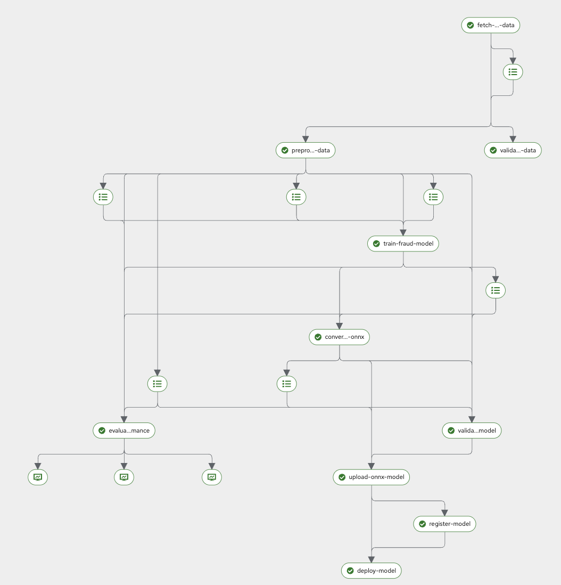

# Fraud Detection Demo

This is an iteration of the Fraud Detection demo committed [here](https://rh-aiservices-bu.github.io/fraud-detection/fraud-detection-workshop/index.html), 
and [here](https://github.com/rhoai-mlops/jukebox/tree/9c724ca124d18911c34dcbb5c17e99a61db404b6/production). 

The Fraud Detection demo in this repo is more similar to the latter, rather than the former, except with the minor adjustments: 

* Instead of pulling data from an external posgres, training/validation data is downloaded via rest 
* Output model is now saved to Model registry
* All tasks have base images specified that pull from quay instead of Dockerhub to avoid rate limiting issues
* The model is finally deployed to KServe

## The Pipeline DAG Visual



### Run directly against a dspa via local terminal

First edit these values in [client_run.py](client_run.py)
``` python
DATASTORE_URL = os.environ.get("DATASTORE_URL", "http://gitea.gitea.svc.cluster.local:3000/opentlc-mgr/lm-fraud-detection/raw/branch/main/src/fraud-detection/card_transdata.csv")
dspa = os.environ.get('DSPA_NAME', "dspa")
run_name = os.environ.get('RUN_NAME', "run_name")
experiment_name = os.environ.get('EXPERIMENT_NAME', "fraud-training")
git_revision = os.environ.get('GIT_REVISION', '1.0')
model_prefix = os.environ.get('DEST_MODEL_PREFIX', 'models/fraud-detection-pipeline')
model_name = os.environ.get('MODEL_NAME', 'fraud-detection')
model_registry_endpoint = os.environ.get('MODEL_REGISTRY_ENDOIINT', 'my-model-registry-rest.apps.multus-test.sandbox323.opentlc.com')
model_registry_port = os.environ.get('MODEL_REGISTRY_PORT', '443')
data_connection = os.environ.get('DATA_CONNECTION', 'aws-connection-my-storage')
```
Next, run the script
```bash
oc login --server=<cluster>
./client_run.py
```

### Build pipeline yaml to submit

The will pipeline will be compiled and saved to `fraud_detection_no_cache.yaml`.

```bash
./build_yaml_no_cache.py

```
